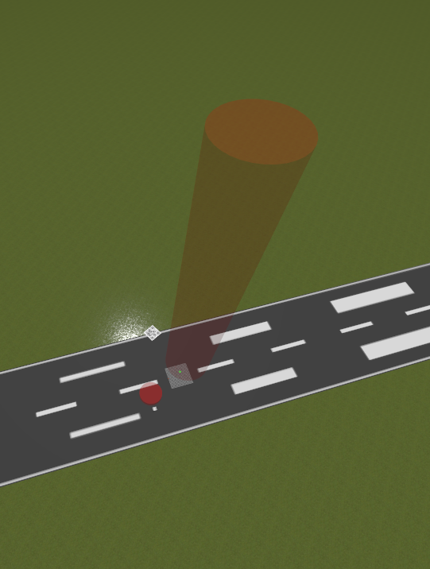
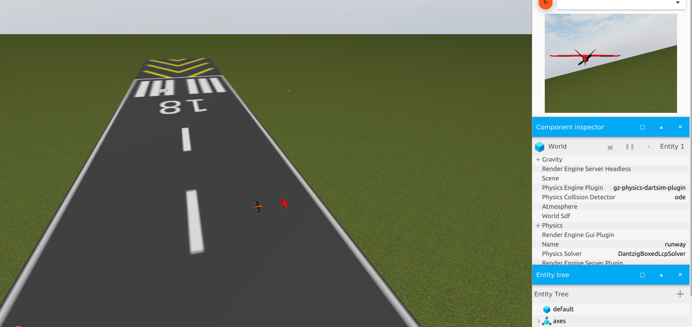
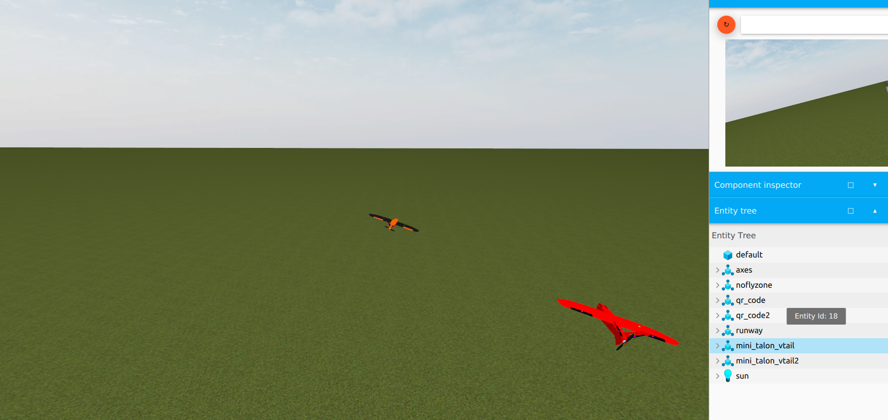

# Fixed-Wing UAV Gazebo SITL Simulation Environment

Gazebo Sim ve ArduPilot SITL kullanılarak geliştirilen, sabit kanatlı İHA sistemlerinin **modelleme, simülasyon ve otonom uçuş testleri** için hazırlanmış bir UAV simulation environment.

Proje, Savaşan İHA çalışmaları kapsamında Mini Talon V-tail platformu için geliştirilmiştir. Fiziksel uçuş testlerinden önce uçuş kontrolü, görev senaryoları, yol takibi, kalkış-iniş ve çoklu İHA operasyonlarının **Software-in-the-Loop (SITL)** ortamında test edilmesini sağlar.



## Project Overview

Bu proje; Gazebo üzerinde oluşturulan özel İHA modellerini ve simülasyon dünyalarını ArduPilot ArduPlane ile entegre ederek gerçek uçuş kontrol yazılımına yakın bir test ortamı oluşturur.

Temel amaçlar:

- İHA modelleme ve fiziksel simülasyon
- ArduPilot ArduPlane ile SITL entegrasyonu
- Otonom uçuş senaryolarının test edilmesi
- Yol takibi ve navigasyon algoritmalarının geliştirilmesi
- Kalkış ve iniş senaryolarının test edilmesi
- Çoklu İHA simülasyonu
- Görüntü işleme ve görev senaryolarının simülasyonu

## Simulation Environment

Simülasyon ortamında özel olarak oluşturulmuş:

- Mini Talon V-tail sabit kanatlı İHA modelleri
- Pist ve çevre modelleri
- Güneş ve aydınlatma modeli
- QR kod görev elemanları
- Tekli ve çoklu İHA senaryoları
- Özel ArduPilot parametre dosyaları

bulunmaktadır.

## Simulation Scenarios

### Multi-UAV Simulation

Birden fazla sabit kanatlı İHA'nın aynı Gazebo ortamında simüle edilmesi ve görev senaryolarının test edilmesi.



### Autonomous Flight Scenario

İHA'ların aynı simülasyon ortamında farklı görev ve uçuş senaryolarında test edilmesi.



## Project Structure

```text
fixed-wing-uav-gazebo-sitl/
├── models/
├── worlds/
├── params/
├── images/
└── README.md


## Simulation Demo

A demonstration of the fixed-wing UAV simulation environment and autonomous flight scenario.

[Watch the simulation video](videos/deneme.webm)


